# Background

## Column {width="30%"}

<h4><strong> Corpus Details at a Glance</strong></h4>

<strong>Overall Theme :</strong> Top 70 most listened in 2025   <strong>Size :</strong> 70 Tracks   <strong>Sub-categories :</strong> 2   <strong>Languages :</strong> English, Hindi, Tamil, Korean  

## Column {width="70%"}

<h4><strong>Corpus Details</strong></h4>

My corpus consists of my top 70 songs that I have consistently been listening to and gone back to repeatedly in the past year. They contain a wide variety of songs with a majority of them being in English, followed by Hindi with a couple of songs in Tamil and Korean. These weren't directly taken from the Spotify Wrapped. Instead I personally handpicked these songs and curated a playlist on Spotify as I listen across multiple platforms and I would like it to accurately represent my tastes. In my opinion I enjoy two distinct kinds of music - one being very high in energy and danceable and the other being much slower, acoustic songs or songs which are still considerably upbeat but sadder lyrics. My music listening is often very dependent on my mood and I have realised I reach out to the former when my spirits are higher and the latter for the days I feel low.    Hence, my 70 tracks consist of 35 'happy,high' songs and 25 'sad,low' songs. I would like to point out that this labelling is very subjective and what I might consider a high or a low may not match another's. Through this portfolio I would like to investigate these two seemingly distinct sub-categories of music that I enjoy and determine if there are any underlying musical similarities in terms of energy, keys, timbre etc. that appeal to me that were previously unknown.     Here after the low category of songs will be referred to as 'Low' and the high category as 'High'.

# Exploratory Analysis

<h5><strong> (i) Track Level Features :</strong></h5>

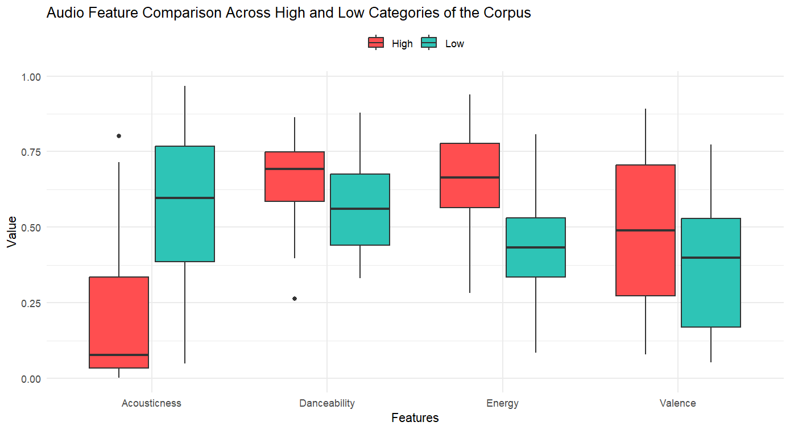{width="65%" style="display:block; margin-left:auto; margin-right:auto;"} A box-plot showing the distribution of acousticness, danceability, energy and valence across the 2 categories shows interesting and intuitive results. On average, Low is significantly more acoustic and has lower energy and valence than High. Although on average Low has lower danceability, it is still surprisingly very close to the High mean.

------------------------------------------------------------------------

<h5><strong> (ii) Loudness Amongst Tracks :</strong></h5>

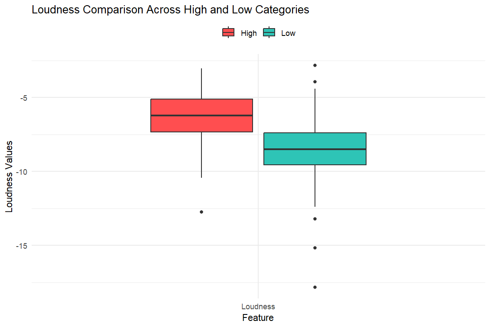{width="65%" style="display:block; margin-left:auto; margin-right:auto;"} Loudness as a feature had to be included separately as it is measured in dB. It is seen that Low on average is not as loud as High.

------------------------------------------------------------------------

<h5><strong> (iii) Tempo Amongst Tracks :</strong></h5>

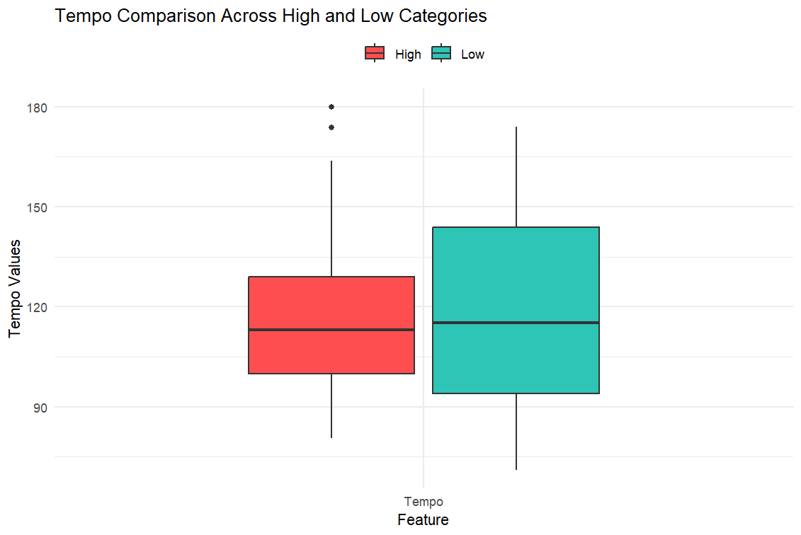{width="65%" style="display:block; margin-left:auto; margin-right:auto;"} Tempo is a very surprising feature. One would assume the 'low' songs would likely be slower and have lesser tempo but it seems that the songs that I consider to be low span across a wide range of tempos with both categories' mean being almost identical.

------------------------------------------------------------------------

<h5><strong> (iv) Danceability vs Valence :</strong></h5>

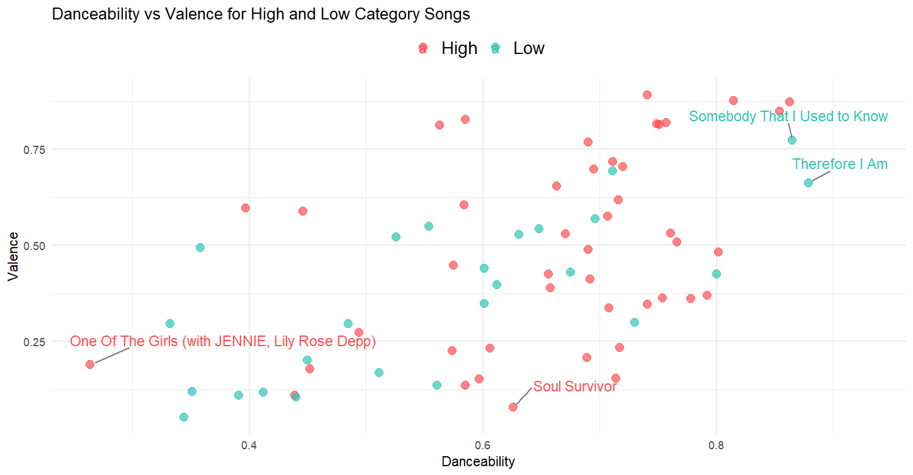{width="65%" style="display:block; margin-left:auto; margin-right:auto;"} Plotting Danceability vs Tempo is an interesting way to see if the way I look at songs is truely what Spotify thinks they are. My entire basis of assigning 'high' and 'low' was that I consider danceable, happy songs to be 'high' and slow, sadder songs to be 'low'. One would assume that on the graph this would mean that the High would be concentrated at the top right corner while the Low would be concentrated on the bottom left. Interestingly, they span across the whole spectrum of danceability as well as valence. Interesting outliers such as Somebody That I Used to Know and Therefore I Am although are part of the Low category have very high valence and danceability and songs like One of The Girls and Soul Survivor (both in the High group) have very low danceability and valence respectively.

# Pitch

For understanding the pitch feature, 2 songs representative of their category were chosen. From Low - Billie Eilish's What Was I Made For? and from High - Pitbull's Give Me Everything Tonight were picked.     

<h5><strong> (i) Chromagram Comparison :</strong></h5>

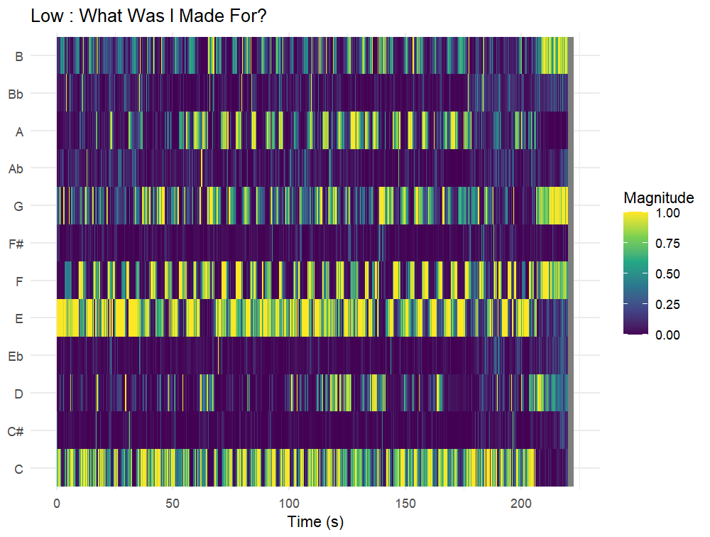{width=49%} 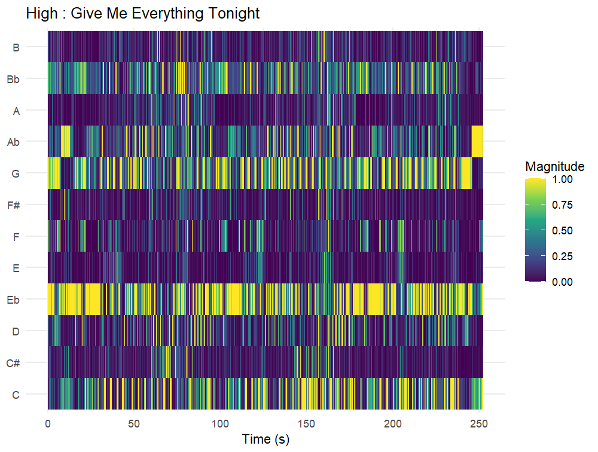{width=49%}

_What Was I Made For?_ shows strong, sustained energy concentrated within a few pitch classes namely E, C, F, G suggesting harmonically simple song. The notes are held for longer periods giving the song its notable melancholic feel. The entire song is quiet consistent in pattern reinforcing the emotional monotony one feels throughtout the song.  

_Give Me Everything Tonight_, on the other hand has energy distributed over a broader range of pitch classes like Eb, C ,G ,Ab ,Bb, D. There's a lot of vertical stripes as opposed to the block pattern in the previous one indicated chords change often which makes the song more energetic and lively. A lot of pitch classes seem to be active simultaneously and there is a high variation throughtout it which ties in perfectly with the dynamic structure of this famous pop hit.

***
<h5><strong> (ii) Pitch Based Self-Similarity Matrices :</strong></h5>
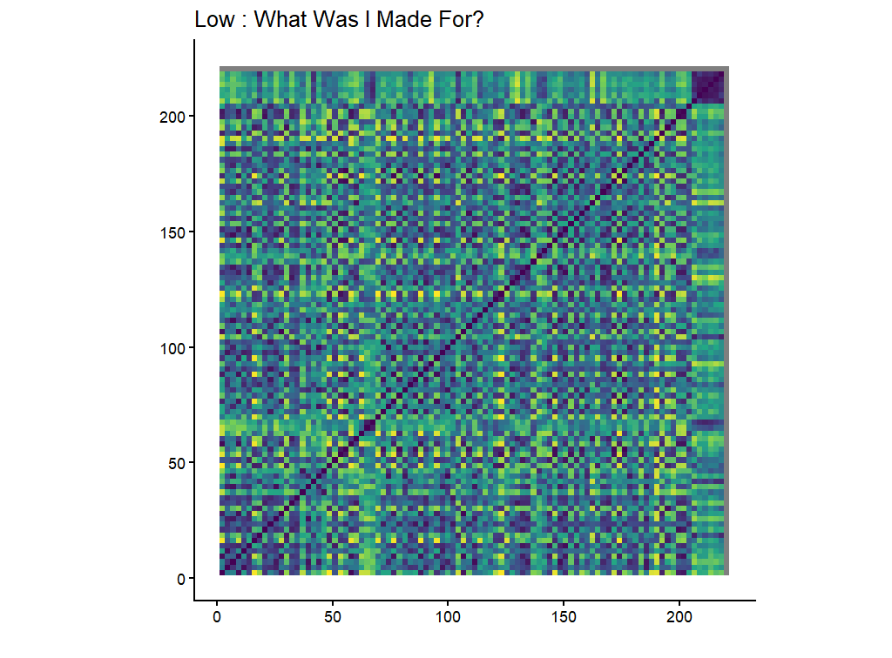{width=49%} 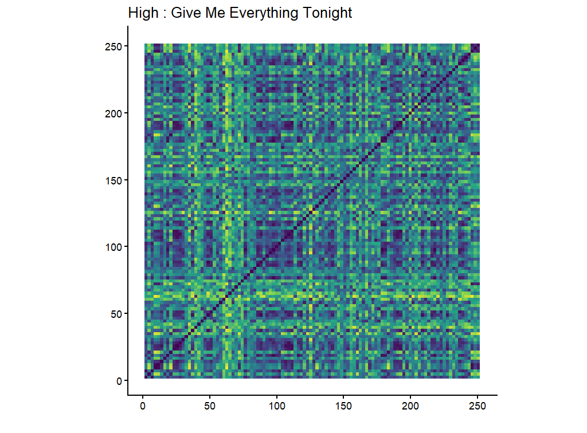{width=49%}
In _What Was I Made For?_ comparing the pitch-based self-similarity matrix, distinct block patterns correspond to the musical sections of the song: A1, A2, B, A1, B, A2, where A represents verses and B the chorus. Around 60 seconds, the first chorus begins, with higher pitch reflected as a yellow/green vertical line in the matrix. A similar pattern appears just before 150 seconds during the second chorus, marked by richer harmonies in the line “cause I, cause I, I don't know how to feel.” Towards the end, the instrumentation is sparser and primarily vocals, producing thicker green bands that reflect the overall pitch stability.

The SSM for _Give Me Everything Tonight_ while does have a checkerboard pattern of sorts, the repeated sections aren't the most identical as the song goes through multiple pre-chorus, each similar yet slightly different. There are 2 distinct sections of dissimilarity. The greenish-yellow line that appears a minute into the song reflects the mid-song rap portion of the piece while the subtler green line around 125 seconds corresponds to a pre-drop breakdown where the vocal phrase leads to the main beat with the background instrumentation temporarily thinned.

# Timbre
<h5><strong> (i) Cepstrogram Comparison :</strong></h5>

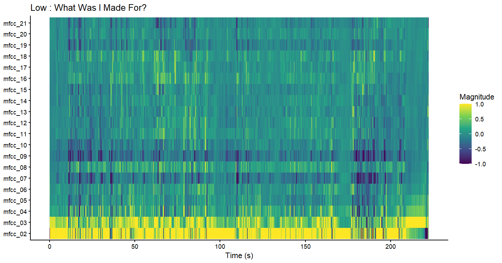{width=49%} 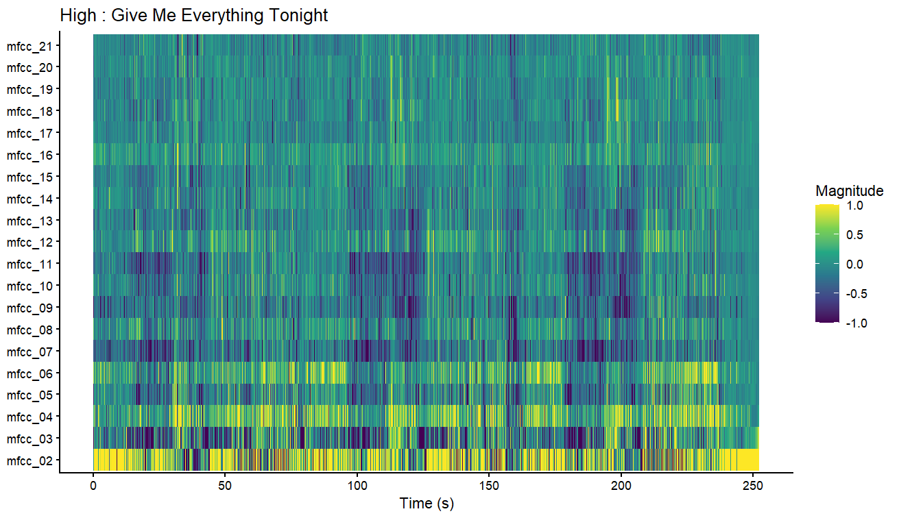{width=49%}

Both cepstrograms share a similar overall structure, dominated by stable lower MFCCs, but  _What Was I Made For_ is notably more uniform and static across all coefficients, reflecting its consistent, stripped-back timbre throughout. _Give Me Everything Tonight_ shows greater temporal variation, particularly in the mid-range MFCCs, with visible patches of contrasting energy that likely correspond to structural changes in the track (drops, build ups, instrumental changes). This supports classifying it as the High-energy song : more timbral complexity and dynamic range is visible, even without interpreting individual coefficients precisely as that if often quite difficult to interpret. 

***

  
<h5><strong> (ii) Timbre Based Self-Similarity Matrices :</strong></h5>

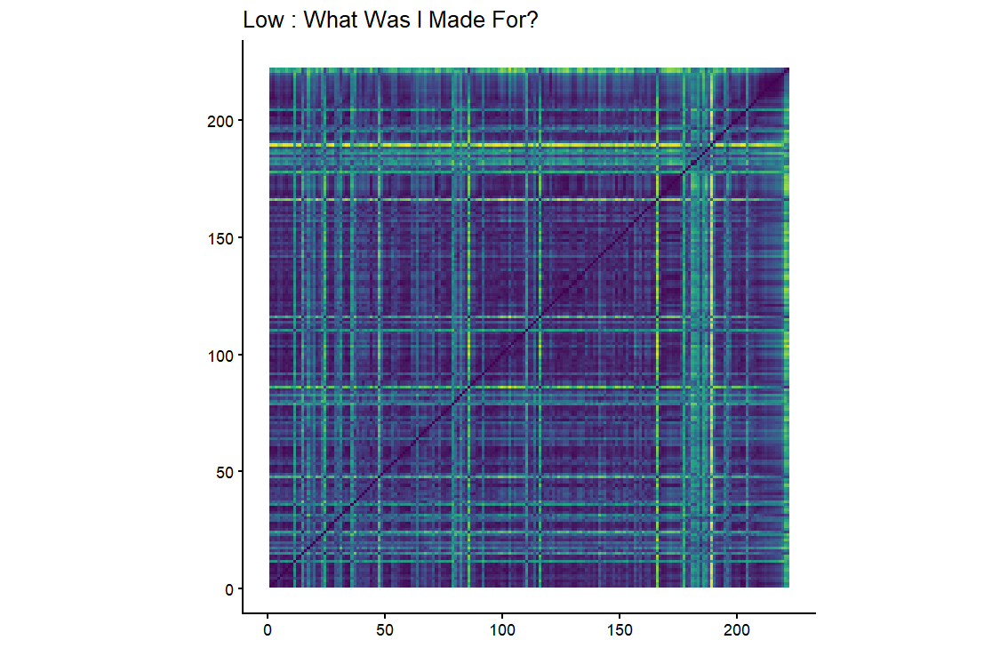{width=49%} 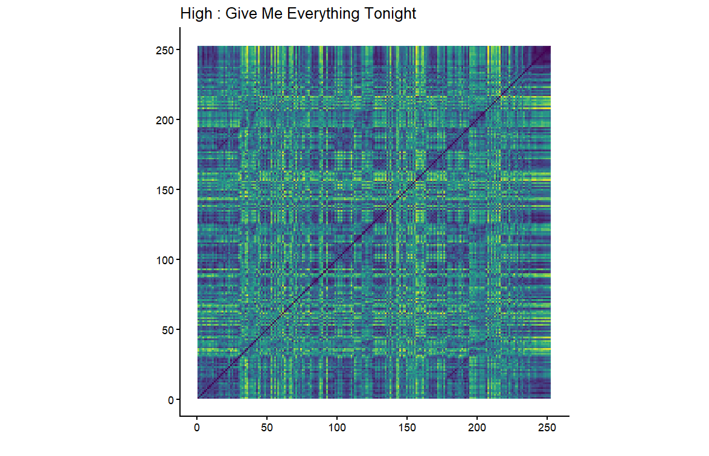{width=49%}
Examining the timbre-based self-similarity matrix of _What Was I Made For_, several connections between sound and visual representation are visible. Around 30–40 seconds, a yellow line corresponds to a peak in the song where additional instruments are heard during the lyrics “taking a drive.” Green lines around 80 seconds reflect sections with mostly humming vocals. Around 120 seconds, new instruments appear, indicated by corresponding lines in the matrix. Thick yellow lines near 180 seconds represent a unique instrument with a “twinkling” or shimmering quality, heard only in that section.

In the timbre based SSM for _Give Me Everything Tonight_ there are multiple, closely spaced lines indicating dissimilarity. This reflects the layered style production of the song where instruments and sounds are constantly being introduced and removed in a cyclical pattern which is a hallmark of dance/EDM-influenced pop production. There are multiple periods of various instrumentation as indicated by the dense stripes around 40-60 second region, 140-160 region and 190-220 region.

# Chords

<h5><strong> (i) Chordogram Comparison :</strong></h5> 
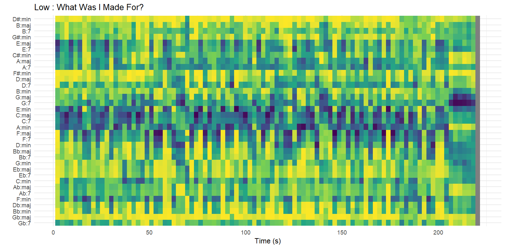{width=49%} 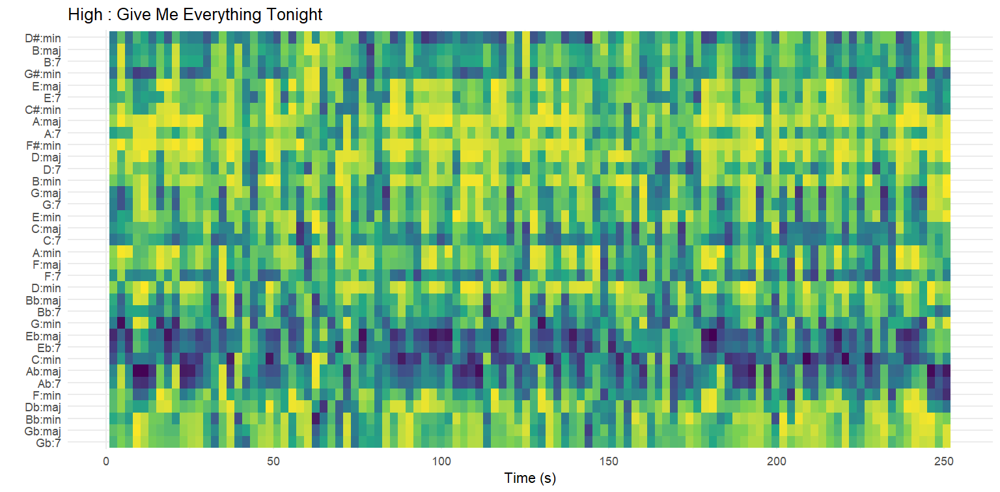{width=49%}
  
In the chordogram for _What Was I Made For_, there is no one single chord that dominates for long. Instead at any given time there are multiple chords that show up yellow/teal which is consistent with the harmonies we hear in the song. The chords are held for a long time with gradual transitions in colours visually representing the slow harmonic movement. Around 60 seconds, we see a brief vertical spike where Billie sustains a high falsetto melisma, a technique of singing a single syllable, here the word 'I', while moving across several different notes creating an expectation of chorus arrival but extending into another pre-chorus instead.

In _Give Me Everything Tonight_, on the other hand, at any time there seems to be only a few specific chords that are yellow with the rest drop close to 0 showing more defined chord changes. There are more vertical shifts within this chordogram matching the quick, more decisive chord changes  that gives the song it's energy and dance=oriented character. A subtle vertical line around 75 seconds matches the song where there is an abrupt change in chords.

# Tempo
For comparison across tempo, the tempograms of the High song - Give Me Everything Tonight were not showing anything significant. Hence, for the purposes of comparison it is switched by a very close substitute from the category - Usher & Pitbull's DJ Got Us Fallin in Love.    

<h5><strong> (i) Tempograms for Low : Billie Eilish's What Was I Made For? :</strong></h5> 

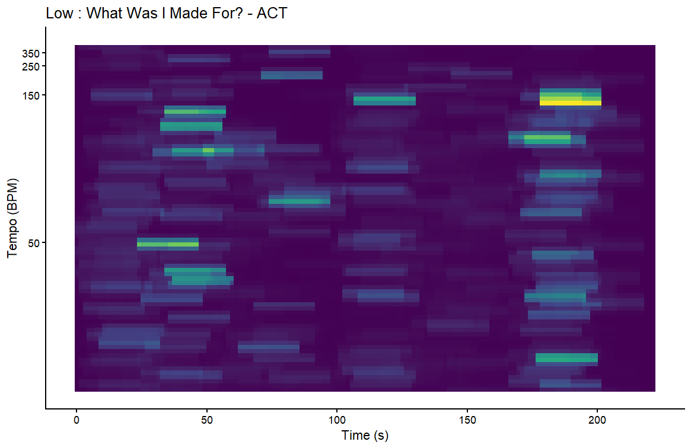{width=49%} 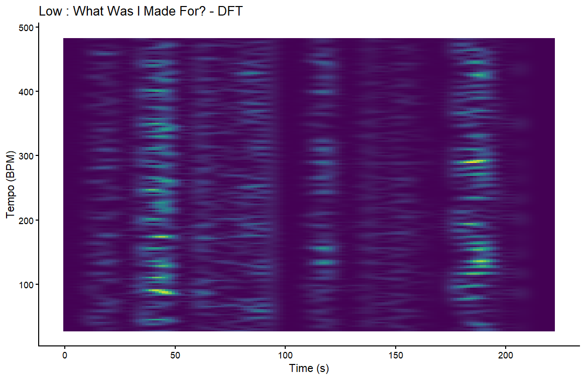{width=49%}

Within the ACT of _What Was I Made For?_ the energy is spread across many different BPM with no single strong horizontal band. This is likely due to the fact that there is no percussion (kick drums or snares) within the song, only light piano making it hard to track the beat. The DFT shows smears of colour throughout the range rather than being concentrated. The light instrumentation with the raspy vocals makes tempo detection ambiguous and given the context of this song, it was a deliberate compositional choice to create an unhurried, pulse-less piece.

***

<h5><strong> (ii) Tempograms for High : Usher & Pitbull's DJ Got Us Fallin in Love :</strong></h5> 

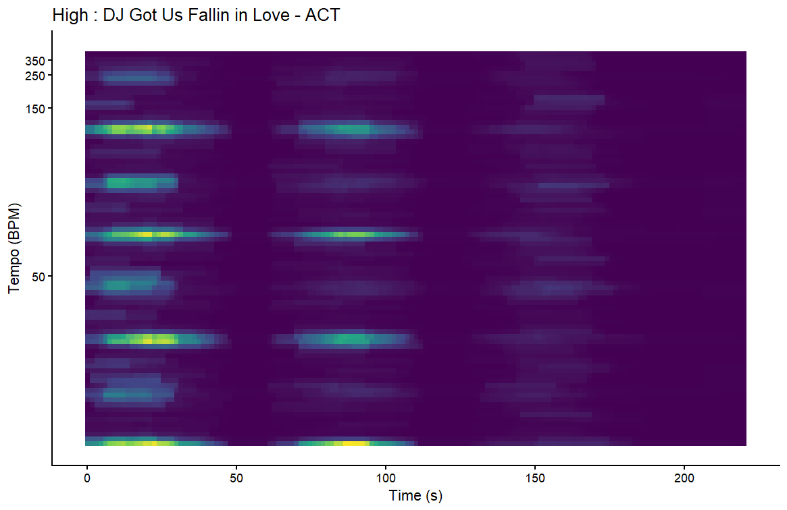{width=49%} 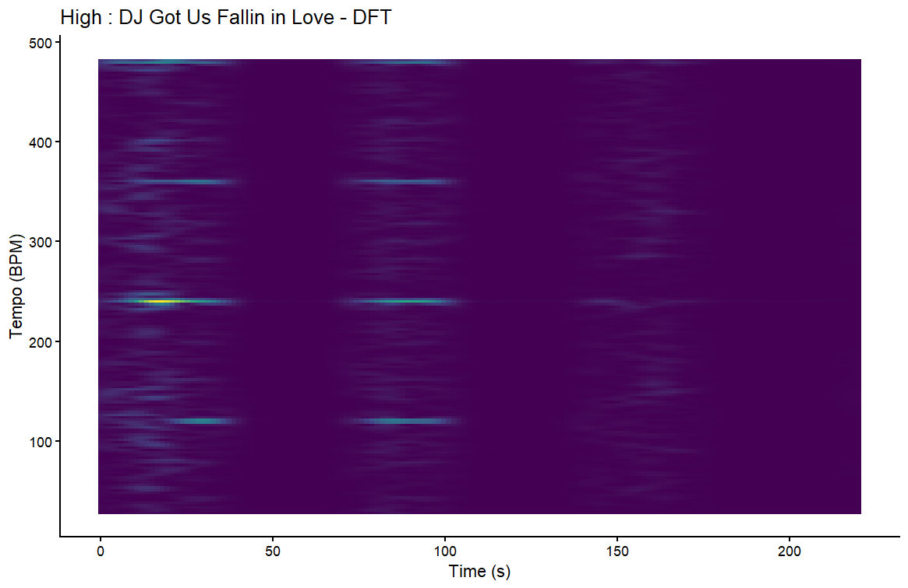{width=49%}
The tempograms for _DJ Got Us Fallin in Love_ show notably stronger tempo detection in the opening section, where there is a clear percussive intro for the algorithm to identify. Both ACT and DFT representations converge around 120 BPM, a tempo highly characteristic of dance pop, with visible sub-harmonic activity at approximately 60 BPM and harmonic activity at higher multiples (240BPM). As the track progresses into its fuller, more layered arrangement, with vocal-heavy sections, tempo detection becomes less consistent. Nevertheless, the early detection strongly confirms the song's dance-floor-oriented rhythmic foundation which is a stark contrast to the calm, pulse-free tempogram of What Was I Made For?

# Clustering

<h5><strong> (i) Hierarchial Clustering on the Total Corpus :</strong></h5> 
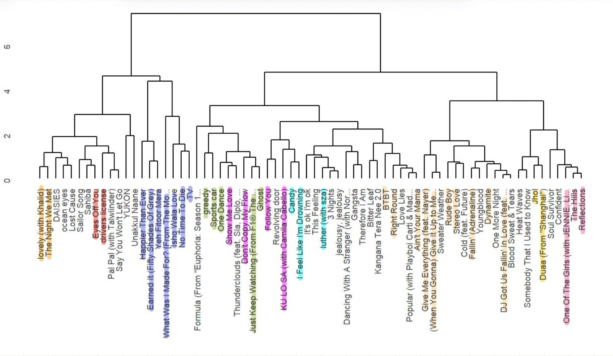{width="75%" style="display:block; margin-left:auto; margin-right:auto;"}
The hierarchial cluster rendered uninteresting results when all the elements of the "recipe" were used. Instead, the top 3 features that were the most useful in classifying music according to the Random Forest Algorithm were picked to see how different the results would be. To my surprise a combination of Loudness, Energy and Acousticness worked out quite well on my whole corpus. It successfully divided it into a 25-75% split of low-dominant and high-dominant songs. This is pretty impressive as my original split of portfolio is at 35-65%. I have highlighted areas in similar colours where I agree the songs in proximity are pretty similar. It has accurately identified common music types like slow, acoustic songs (in dark blue), danceable club hits of Pitbull, Usher etc (in light orange in the middle), upbeat but still a very different vibe of songs in light pink like those by the Weeknd and The Neighbourhood.

***

<h5><strong> (ii) Hierarchial Clustering on the Low Sub-Group :</strong></h5> 
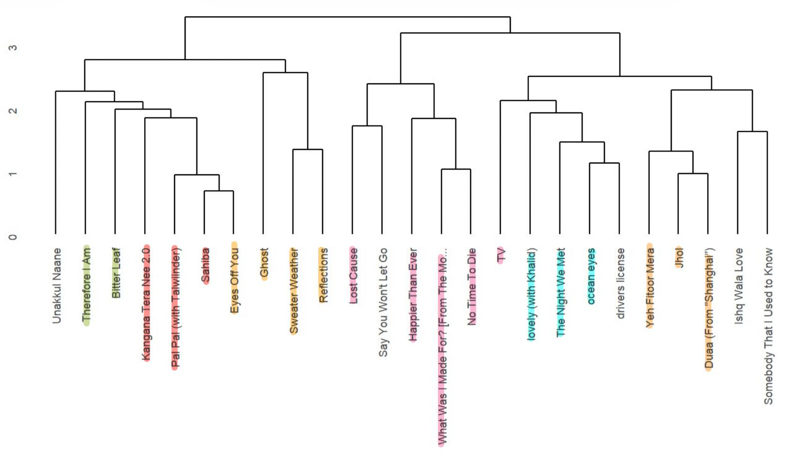{width="75%" style="display:block; margin-left:auto; margin-right:auto;"}
The results of the clustering on just the 25 low songs were more interesting. It essentially divided it into 2 sub-clusters of songs that are have lower valence and  yet still quiet upbeat like Therefore I am, Bitter Leaf, Pal Pal and the bigger cluster consists of more acoustic, more traditionally 'sadder' sounding songs. This clustering reveals an insight that even within the Low sub-group a futher classification could be made on the basis of beats/tempo. This also explains the wide range of tempo within the Low category in the box-plots during the exploratory analysis. It also seems to have accurately clustered most of Billie Eilish's songs in the middle from Lost Cause to Lovely.

# Wrap Up
{width="85%" style="display:block; margin-left:auto; margin-right:auto;"}
Across the various analytical dimensions of pitch, timbre and tempo, it is seen that there exists a meaningful distinction between the 2 categories of songs. Chromagrams and chordograms revealed that Low songs similar to What Was I Made For? have sustained pitch classes with gradual chord transitions reflecting an introspective, emotionally restrained character which often is very cathartic to hear during times of distress. The High sings by contrast, have a broader pitch classes, with distinct chord changes accompanied by frequent cyclical timbrel variation giving it its typical dance music character. While those within the High category are likely to be at the popular 120 BPM, the Low category seems to be a collection of intentionally pulse-free songs. 

It is these underlying musical elements that shape how we associate songs with happiness or sadness. This analysis emphasizes how features imperceptible to the untrained ear — harmonic rhythm, timbrel layering, rhythmic pulse — are in fact fundamental in conveying emotional tone and constructing or withholding tension.

These 2 categories might seem like complete opposites but based on all the combined analysis, an insight I derived is perhaps if I sub-divide my Low category further, I might find a middle ground between the two, thereby having one of low, acoustic, pulse-free songs, one with more beats yet still introspective and low valence and one with high, danceable energy. With these 3 new categories my taste in music would seem less abrupt and perhaps from the middle ground the extreme end I go to is just subjected by the day.

